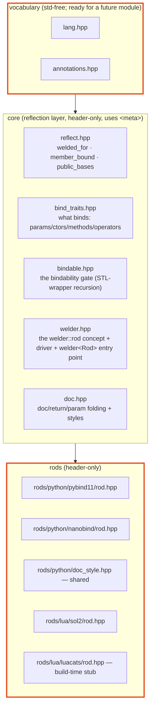
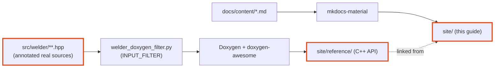

# Architecture

welder is a language-agnostic **core** plus pluggable **rods** (welding rods — the
backends that lay the bindings down), joined by **static polymorphism**. The core
owns *all* the reflection work; a rod supplies only *emission primitives*. The core
never depends on a rod.



## Core vs. rod

The **core** decides:

- **what** binds — `bind_traits.hpp` (param / ctor / method / operator / namespace
  selectors, native-base collection);
- whether each type is **representable** — `bindable.hpp` (the
  [bindability gate](guide/bindability.md));
- how to **walk** types / namespaces / bases — `welder.hpp`'s generic driver.

A **rod** is a stateless struct (`welder::rods::<name>::rod`) satisfying the
`welder::rod` concept. It provides ~16 emission primitives and *nothing else*:

- **associated:** `language`, `module_type`, and `has_native_caster<T>` — the one
  bindability fact the core can't know;
- **type binding:** `make_class`, `add_default_ctor`, `add_constructor`,
  `add_aggregate_constructor`, `add_field`, `add_method`, `add_static_method`,
  `add_operator`, `special_method_name`;
- **enum binding:** `make_enum`, `add_enumerator`, `finish_enum`;
- **namespace/module binding:** `open_module`, `set_module_doc`, `add_function`,
  `add_variable`, `add_submodule`, `close_module`.

The public `welder::welder<Rod>` (`weld_type` / `weld_namespace` /
`weld_namespace_as_submodule` / `weld_module`) is the single, shared entry point
that plugs a rod into the generic driver — there are no per-rod wrapper functions.

!!! quote "Adding a language"

    …is writing one rod struct; the `welder::welder<Rod>` entry point is shared. The
    nanobind rod is nearly a copy of the pybind11 one (same class-handle model,
    sharing the Python docstring styles); the sol2 Lua rod implements the same
    primitives against Lua's C API. The core is reused verbatim — see the
    [Rods](backends/index.md) section for each one. The **luacats** rod reuses
    the *same driver* for a different job: instead of emitting runtime registration,
    it walks the welded namespace and writes a LuaCATS `---@meta` stub at build time.

## Header-only, and the vocabulary boundary

welder ships **header-only** today. A C++20 `import welder;` module wrapper is
planned but currently deferred — the toolchain reasons (a gcc-16 `-freflection` ×
modules conflict, and no P2996 support yet in Clang/MSVC) are laid out on the
[Header-only for now](header-only.md) page.

The header layout still reflects the boundary that a future module would export:

> The std-free **vocabulary** (`lang`, `annotations`) is kept separate from
> everything that touches `<meta>`. Reflection (`reflect.hpp`) and all rods are the
> `<meta>`-using layer.

Why the split survives even without a module: on gcc-16, any std header in a module
unit's purview (even `<cstdint>`) makes every consumer that both `import`s it *and*
textually `#include`s std headers fail with `conflicting imported declaration`
errors — and `<meta>` / pybind11 include std textually. So the vocabulary is kept
std-free (module-ready), while anything touching `<meta>` stays a header. Once the
`-freflection`/modules bugs are fixed, `lang.hpp` + `annotations.hpp` can be
re-exported by a module wrapper unchanged.

The practical consequence for a consuming TU: provide the vocabulary **first**
(`#include <welder/vocabulary.hpp>`), then the rod header. The reflection and rod
headers deliberately don't re-include the vocabulary — that would redeclare it.

## Documentation

The docs you're reading are two toolchains presented as one site:



- **mkdocs-material** renders this narrative guide from `docs/content/`.
- **Doxygen** renders the full C++ reference — public API *and* `detail/` internals
  *and* all templates — from the real headers, through the
  [INPUT_FILTER](guide/cpp-docs.md), themed with doxygen-awesome-css to match.
- CMake (`docs/CMakeLists.txt`) provisions an isolated `uv` environment, builds the
  guide, then drops the Doxygen HTML into `site/reference/`.

Build it with:

```bash
cmake --preset welder-gcc16 -DWELDER_BUILD_DOCS=ON
cmake --build --preset welder-gcc16 --target welder-docs
# open build/welder-gcc16/docs/site/index.html
```

Or serve it live with `--target welder-docs-serve`.
