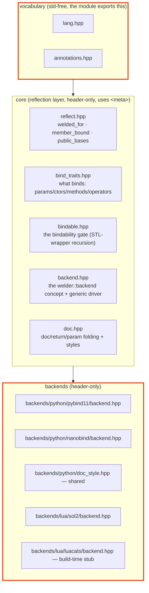
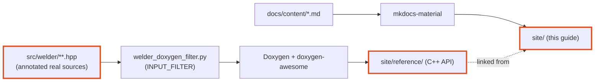

# Architecture

welder is a language-agnostic **core** plus pluggable **backends**, joined by
**static polymorphism**. The core owns *all* the reflection work; a backend supplies
only *emission primitives*. The core never depends on a backend.



## Core vs. backend

The **core** decides:

- **what** binds — `bind_traits.hpp` (param / ctor / method / operator / namespace
  selectors, native-base collection);
- whether each type is **representable** — `bindable.hpp` (the
  [bindability gate](guide/bindability.md));
- how to **walk** types / namespaces / bases — `backend.hpp`'s generic driver.

A **backend** is a stateless struct satisfying the `welder::backend` concept. It
provides ~16 emission primitives and *nothing else*:

- **associated:** `language`, `module_type`, and `has_native_caster<T>` — the one
  bindability fact the core can't know;
- **type binding:** `make_class`, `add_default_ctor`, `add_constructor`,
  `add_aggregate_constructor`, `add_field`, `add_method`, `add_static_method`,
  `add_operator`, `special_method_name`;
- **enum binding:** `make_enum`, `add_enumerator`, `finish_enum`;
- **namespace/module binding:** `open_module`, `set_module_doc`, `add_function`,
  `add_variable`, `add_submodule`, `close_module`.

The public `welder::pybind11::bind` / `bind_namespace` / `build_module` are one-line
wrappers that plug `pybind11::detail::backend` into the generic driver.

!!! quote "Adding a language"

    …is writing one backend struct plus thin public wrappers. The nanobind backend
    is nearly a copy of the pybind11 one (same class-handle model, sharing the
    Python docstring styles); the sol2 Lua backend implements the same primitives
    against Lua's C API. The core is reused verbatim — see the
    [Backends](backends/index.md) section for each one. The **luacats** backend reuses
    the *same driver* for a different job: instead of emitting runtime registration,
    it walks the welded namespace and writes a LuaCATS `---@meta` stub at build time.

## The module-vs-header boundary

This is a gcc-16-specific constraint worth understanding:

> The `welder` **module** exports only the std-free **vocabulary** (`lang`,
> `annotations`). Reflection (`reflect.hpp`) and all backends are **header-only**
> and *not* part of the module.

Why: on gcc-16, any std header in a module unit's purview (even `<cstdint>`) makes
every consumer that both `import`s it *and* textually `#include`s std headers fail
with `conflicting imported declaration` errors — and `<meta>` / pybind11 include std
textually. So the vocabulary stays std-free and modular; anything touching `<meta>`
stays a header. Partitioning doesn't help (it's std-in-purview, not partitioning).

The practical consequence: provide the vocabulary **first** (`import welder;` *or*
`#include <welder/welder.hpp>`), then the backend header. The reflection/backend
headers deliberately don't re-include the vocabulary — that would redeclare what
`import welder;` provides.

## Documentation

The docs you're reading are two toolchains presented as one site:



- **mkdocs-material** renders this narrative guide from `docs/content/`.
- **Doxygen** renders the full C++ reference — public API *and* `detail/` internals
  *and* all templates — from the real headers, through the
  [INPUT_FILTER](guide/cpp-docs.md), themed with doxygen-awesome-css to match.
- CMake (`docs/CMakeLists.txt`) provisions an isolated `uv` environment, builds the
  guide, then drops the Doxygen HTML into `site/reference/`.

Build it with:

```bash
cmake --preset welder-gcc16 -DWELDER_BUILD_DOCS=ON
cmake --build --preset welder-gcc16 --target welder-docs
# open build/welder-gcc16/docs/site/index.html
```

Or serve it live with `--target welder-docs-serve`.
