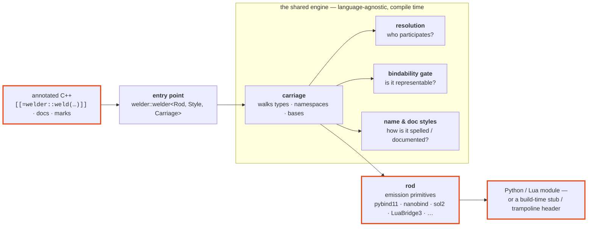
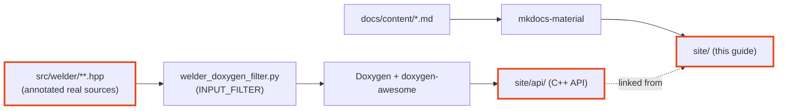

# Architecture

welder is a small pipeline of swappable policies, joined by **static
polymorphism** — no virtual calls, no runtime registry; every decision below is
made at **compile time**, inside your binding translation unit. Each piece has
one job:

- the **vocabulary** — the annotations you write in your headers;
- the **entry point** — `welder::welder<Rod, Style, Carriage>`, the one struct
  you call;
- the **carriage** — the traversal that walks your types, namespaces and bases;
- its **resolution** — the policy deciding *which* entities participate;
- the **bindability gate** — the check that everything bound is representable;
- the **name & doc styles** — how identifiers and docstrings are rendered;
- the **rod** — the only language-specific piece, laying the bindings down.



The split to remember: **the engine decides, the rod spells.** Everything about
*what* binds — reading annotations, resolving policy and marks, flattening
non-welded bases in, recursing namespaces, checking each type is representable,
folding docstrings, restyling names — is shared, language-agnostic core. A rod
never re-implements any of it; it is only ever told "register this class",
"add this method".

## The entry point: `welder::welder<Rod, Style, Carriage>`

One struct is all you drive, and its three template slots are the three
policies you can swap:

| Slot | Selects | Default |
|---|---|---|
| `Rod` | the language & framework emitted — any type satisfying the `welder::rod` concept | *(required)* |
| `Style` | the [name style](guide/naming.md) every generated name flows through | `welder::naming::none` (no renaming) |
| `Carriage` | the [traversal](#the-carriage-and-its-resolution) — which markers it obeys | `welder::stitch_welding_carriage` |

Its static members each automate one stage of the usual hand-binding flow —
everything around the call stays ordinary hand-written binding code:

| Call | Automates |
|---|---|
| `weld_type<T>(m)` | one class or enum ([guide](guide/binding-types.md)) |
| `weld_function<^^fn>(m)` / `weld_variable<^^var>(m)` | one free function / one global ([guide](guide/namespaces-modules.md#binding-a-single-function-or-variable)) |
| `weld_namespace<^^ns>(m)` | a namespace's contents, into an existing module ([guide](guide/namespaces-modules.md)) |
| `weld_namespace_as_submodule<^^ns>(m)` | the same, as a fresh submodule |
| `weld_module<^^ns>(m, pre, post)` | a whole module — what the `WELDER_MODULE` macro wraps ([guide](guide/namespaces-modules.md#binding-a-whole-module)) |

`weld_type` returns the rod's class handle, so bespoke framework calls (a custom
`__repr__`, an ownership policy) chain right onto what welder registered.

Every entry point is a **one-line forward to the carriage** — the entry point
holds no traversal logic of its own. That is what makes it composable: inject a
different carriage, or *subclass* `welder::welder` (it is all-static, so
deriving simply gives your own driver type the bound `rod_type` / `name_style`
/ `carriage_type` and the entry points) to assemble bespoke routines from the
same gated building blocks.

## The carriage and its resolution

In welding, the *carriage* is the mechanism that drives the torch — fed by the
rod — steadily along the joint. Here it is the traversal driver: it walks a
reflected type or namespace and drives the rod's emission primitives along it,
owning all the orchestration (base flattening, the bindability gate, name
resolution, doc folding). The one thing it delegates is *which entities
participate* — a **resolution** policy. Two ship, each with a carriage alias:

| Carriage | Resolution | Binds |
|---|---|---|
| `welder::stitch_welding_carriage` *(default)* | marker-directed | only where `weld` / `policy` / marks direct — like a stitch weld, intermittent and deliberate |
| `welder::tack_welding_carriage` | greedy | an **unmarked** third-party library: every reflectable type, function and global, ignoring the missing `weld` markers ([guide](guide/namespaces-modules.md#tack-welding-an-unmarked-library)) |

Both run the same traversal and the same [bindability
gate](guide/bindability.md) — tack welding drops the *marker* requirement,
never the representability one. The complete decision procedure — every
entity kind, the member-resolution and access-admission machines, nested types
and member aliases, and the registration oracle, each as a flowchart — has its
own page: **[The resolution algorithm](resolution.md)**. The seam is open: a custom
`welder::carriages::basic_carriage<Resolution>` plugs in any resolution that can
answer the five participation questions (does this entity/member/nested
namespace participate? is this base native? which bases are native?).

## The rod: one language, ~18 primitives

A rod is a stateless struct (`welder::rods::<name>::rod`) satisfying the
`welder::rod` concept — the emission contract, and *nothing else*:

| Group | Primitives |
|---|---|
| **Associated facts** | `language`, `module_type`, the `class_handle_type<T>` / `enum_handle_type<E>` aliases, and `has_native_caster<T>` |
| **Binding a type** | `make_class`, `add_default_ctor`, `add_constructor`, `add_aggregate_constructor`, `add_field`, `add_method`, `add_static_method`, `add_operator`, `special_method_name` |
| **Binding an enum** | `make_enum`, `add_enumerator`, `finish_enum` |
| **Binding a module** | `open_module`, `set_module_doc`, `add_function`, `add_variable`, `add_submodule`, `close_module` |

`has_native_caster<T>` deserves a callout: it is the **one bindability fact the
core cannot know** — can this framework convert `T` without welder registering
a class for it? The [gate](guide/bindability.md) asks the rod that single
question and derives everything else itself.

!!! quote "Adding a language"

    …is writing one rod struct; the entry point, carriage, gate and styles are
    reused verbatim. The nanobind rod is nearly a copy of the pybind11 one
    (same class-handle model, sharing the Python docstring styles); the two Lua
    rods implement the same primitives against their frameworks. And a rod
    doesn't have to emit *bindings*: the build-time **luacats** and
    **trampolines** rods drive the very same carriage but write text — a LuaCATS
    `---@meta` stub, or the Python virtual-override trampoline header. See the
    [Languages](backends/index.md) section for each rod.

## Name & doc styles

Two smaller policies cut across every rod:

- A **name style** (the entry point's `Style` slot) restyles each identifier
  into the target language's convention through per-kind hooks — e.g.
  `welder::rods::python::pep8` (`processFile` → `process_file`). A per-entity
  `weld_as` beats the style; a call-site `name` argument beats even that.
  See [Naming conventions](guide/naming.md).
- A **doc style** (a *rod's* template parameter, e.g. `rod<numpy_style>`)
  formats the folded `doc` / parameter / `returns` text into the dialect your
  documentation tooling expects. It sits on the rod because docstring dialects
  are language-ecosystem-specific. See [Docstrings](guide/docstrings.md).

## Header-only, and the vocabulary boundary

welder ships **header-only** today; a planned C++20 `import welder;` wrapper is
deferred until the gcc-16 `-freflection`/modules conflicts are fixed and a
second compiler implements P2996 (the full story: [Header-only for
now](header-only.md)). The layout keeps the boundary that wrapper would draw:
the **vocabulary** (`lang.hpp`, `annotations.hpp`) is std-include-free and
module-ready, while everything touching `<meta>` — the engine and the rods —
stays textual. The practical rule for a consuming TU: include
`<welder/vocabulary.hpp>` *first*, then the rod header (which pulls in the rest
and deliberately does not redeclare the vocabulary).

## Where things live

For when you need the file rather than the concept:

| Concept | Header |
|---|---|
| Vocabulary (annotations, `lang`) | `<welder/vocabulary.hpp>` → `lang.hpp` + `annotations.hpp` |
| Entry point | `<welder/welder.hpp>` |
| Carriage + resolutions | `<welder/carriage.hpp>` |
| Rod contract & interface concepts | `<welder/concepts.hpp>` |
| Annotation reading (`welded_for`, `member_bound`) | `<welder/reflect.hpp>` |
| What binds (ctor/method/operator selection) | `<welder/bind_traits.hpp>` |
| Bindability gate | `<welder/bindable.hpp>` |
| Doc folding + `cleandoc` | `<welder/doc.hpp>` |
| Name styling core (`restyle`, stock styles) | `<welder/naming.hpp>` |
| A rod | `<welder/rods/<lang>/<framework>/rod.hpp>` (+ `module.hpp` for `WELDER_MODULE`) |

## Documentation

The docs you're reading are two toolchains presented as one site:



- **mkdocs-material** renders this narrative guide from `docs/content/`.
- **Doxygen** renders the full C++ reference — public API *and* `detail/` internals
  *and* all templates — from the real headers, through the
  [INPUT_FILTER](guide/cpp-docs.md), themed with doxygen-awesome-css to match.
- CMake (`docs/CMakeLists.txt`) provisions an isolated `uv` environment, builds the
  guide, then grafts the Doxygen HTML into `site/api/` (the `inject_reference.py`
  mkdocs hook).
- Inline code naming a welder API entity — `welder::welder`, `weld_type`,
  `WELDER_MODULE`, … — links into the reference **automatically**: the
  `apilink.py` mkdocs hook resolves each span against the Doxygen **tag file**,
  so the guide never hand-writes a reference URL and a renamed symbol simply
  stops linking instead of 404ing.

Build it with:

```bash
cmake --preset welder-gcc16 -DWELDER_BUILD_DOCS=ON
cmake --build --preset welder-gcc16 --target welder-docs
# open build/welder-gcc16/docs/site/index.html
```

Or serve it live with `--target welder-docs-serve`.