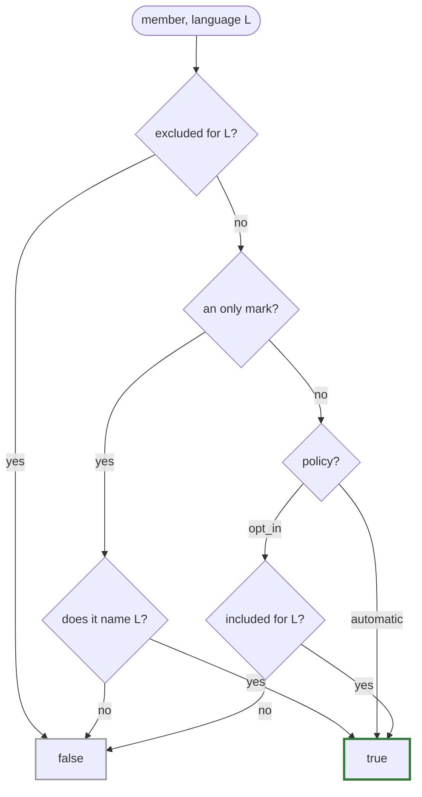

# Annotation vocabulary

Everything welder does is driven by attributes in the `welder::` namespace, spelled
with P3394's `[[=…]]` annotation syntax. There are only a handful.

| Annotation | Meaning |
|---|---|
| `weld(lang…)` | Languages this type is exposed to. **Required to bind.** |
| `policy::automatic` | *(default)* Greedy: reflect every member unless excluded. |
| `policy::opt_in` | Conservative: bind only members marked `include`. |
| `mark::exclude` | Exclude member from **all** welded languages. |
| `mark::exclude(lang…)` | Exclude member from the listed languages only. |
| `mark::include` / `mark::include(lang…)` | Opt a member in (meaningful under `opt_in`). |
| `mark::only(lang…)` | The **complete** set of languages this member may bind for — closed-world counterpart of `exclude`; under `opt_in` it is also the opt-in. Always called with ≥ 1 language. |
| `mark::trust_bindable` / `…(lang…)` | Vouch that a member's type / callable signature is representable outside welder's view. |
| `trust_bindable<T> = true` | Type-level form: trust `T` everywhere it appears. |
| `doc("text")` | Docstring for a class / namespace / function / parameter. |
| `returns("text")` | Documents a function's return value. |
| `tparam("T", "text")` | Documents a template parameter (repeatable, ordered). |
| `weld_as([lang…,] "name")` | Force this entity's target name **verbatim**, bypassing the [name style](naming.md). The name is last; any languages it applies to come first (none = all). |
| `return_policy([lang…,] rv::kind)` | How a callable's returned object is owned/converted. Kind last, optional leading `lang` markers scope it (none = all). Honored by the Python rods; ignored by the Lua rods (ownership is structural). |
| `keep_alive(nurse, patient)` | Tie one call entity's lifetime to another's (`patient` kept alive until `nurse` is collected). A Python-binding concept; the Lua rods ignore it. |

!!! example "In the cookbook"

    [Recipe 02 — Discovery rules](../cookbook/discovery.md) exercises most of this
    vocabulary in one runnable module: policies, marks, namespace pruning and
    `weld_as`. [Recipe 07](../cookbook/multilang.md) adds the per-language pieces
    (`mark::only`, per-language `weld_as`, `mark::trust_bindable`).

## `weld` — the discovery marker

`weld` does two things: it declares a type **discoverable** (an independently
registered entity welder may bind, e.g. when walking a namespace), and it lists the
**languages** it is exposed to.

```cpp
struct [[=welder::weld(welder::lang::py, welder::lang::lua)]]  // py + lua
Widget { /* … */ };
```

A `lang` is stored as a bit in an `unsigned` mask, and the value space is **open**:
`welder::lang::py` / `lua` name the shipped languages, while
`welder::user_lang<Slot>` mints an identity for a language welder doesn't ship —
usable everywhere a `lang` is (see
[Binding a new language](extending.md#binding-a-new-language)). `weld` is
*required*: a type with no `weld` binds to nothing.

!!! info "`weld` is not an inheritance directive"

    It marks an entity as independently registrable — the most-derived type's
    `weld` drives which languages bind, and a base *need not* be welded. See
    [Inheritance](inheritance.md).

## `policy` — greedy or conservative

The policy on a type decides the default for its members:

=== "`automatic` (default)"

    ```cpp
    struct [[=welder::weld(welder::lang::py)]]           // policy::automatic implied
    Greedy {
        int a;                              // bound
        int b;                              // bound
        [[=welder::mark::exclude]] int c;   // opted *out*
    };
    ```

=== "`opt_in`"

    ```cpp
    struct
    [[=welder::weld(welder::lang::py), =welder::policy::opt_in]]
    Careful {
        [[=welder::mark::include]] int a;   // bound
        int b;                              // NOT bound (nothing opts it in)
    };
    ```

## `mark` — per-member overrides

`exclude`, `include` and `only` are the per-member overrides. `exclude` and
`include` accept an optional language list; with no argument they apply to
**all** welded languages. `only` names the *complete* set of languages the
member may bind for, so it must always be called with at least one:

```cpp
struct [[=welder::weld(welder::lang::py, welder::lang::lua)]]
Mixed {
    std::uint32_t first;                                              // bound everywhere
    [[=welder::mark::exclude]] std::uint32_t second;                  // bound nowhere
    [[=welder::mark::exclude(welder::lang::lua)]] std::string third;  // py, not lua
    [[=welder::mark::include(welder::lang::py)]] std::string last;    // opt-in
    [[=welder::mark::only(welder::lang::py)]] std::uint64_t handle;   // py, and ONLY py
};
```

`exclude` and `only` differ in world-view: `exclude(lua)` is **open** — it names
the languages to hide from, and any language it doesn't name (including a
[user-defined one](extending.md#binding-a-new-language) minted later) still
binds. `only(py)` is **closed** — nothing outside its list ever binds, no
matter what languages join the build afterwards. Under `policy::opt_in`, `only`
also counts as the member's opt-in, so no separate `include` is needed.

!!! note "Marks resolve per overload — constructors included"

    Every **overload** of a name carries its own marks: exclude one and its
    siblings still bind (welder hands each rod the surviving overload set whole,
    so this holds on the Lua rods' one-value-per-name tables too). Individual
    **constructors** resolve the same way — under `policy::opt_in`, only
    marked-`include` constructors bind. Two fail-safes back that up: the
    **default constructor** stays outside opt_in's default-out (an implicit one
    has no declaration to mark — though explicit marks on a *declared*
    `T() = default;` are honored, so you *can* suppress it); and policy filtering
    that would leave a type with **no constructor at all** is a hard compile
    error rather than a silently uninstantiable class — unless the emptiness is
    explicit (`mark::exclude` on every constructor declares a factory-only
    surface, and compiles).

## The resolution rule

For a given language `L`, `member_bound(member, L, policy)` decides:



- Excluded for `L` → **false** (exclude is the strongest word — it beats an
  `only` naming `L` too).
- Else an `only` mark → **true iff** it names `L`, under either policy
  (repeated `only` marks union their languages).
- Else `automatic` → **true**.
- Else (`opt_in`) → **true iff** explicitly included for `L`.

A mask of `0` on an `exclude`/`include` spec is the sentinel for "all languages"
(a bare `mark::only` has no such meaning — "only, for every language" restricts
nothing — and is diagnosed at compile time).

!!! note "Naming deviation"

    The original sketch used `policy::auto`, but `auto` is a reserved keyword, so
    welder spells it `policy::automatic`. Under `automatic`, an `include` mark is
    redundant (a diagnostic for that is a TODO).

## `return_policy` — how a returned object is owned

By default a rod lets its backend pick how a call's return value crosses into the
target language. `return_policy` overrides that, in welder's backend-neutral
spelling of the return-value policy — the same set pybind11 (`return_value_policy`)
and nanobind (`rv_policy`) expose:

```cpp
struct [[=welder::weld(welder::lang::py)]] Owner {
    // A live, non-owning view; writing through it writes the C++ object, and the
    // owner is kept alive while the view lives.
    [[=welder::return_policy(welder::rv::reference_internal)]]
    Inner& view() { return inner_; }

    // An independent copy — the caller's edits don't touch the owner.
    [[=welder::return_policy(welder::rv::copy)]]
    Inner& snapshot() { return inner_; }
};
```

The kinds live in `welder::rv::` — `automatic` (the rod default), `automatic_reference`,
`take_ownership`, `copy`, `move`, `reference`, `reference_internal`, and `none`
(nanobind-only; diagnosed on pybind11). Like `weld_as`, the kind is last and any
leading `lang` markers scope it — so a call can take one policy in Python and
another (or none) elsewhere:

```cpp
[[=welder::return_policy(welder::lang::py, welder::rv::take_ownership)]]
Thing* make();
```

!!! info "The Lua rods decide ownership structurally"

    The garbage-collected Lua runtimes (sol2, LuaBridge3) have no return-value-policy
    knob: ownership is decided by the C++ **return type** — a value becomes a
    VM-owned copy/move, a pointer or reference a non-owning view. So the Lua rods
    **ignore** `return_policy` at runtime, exactly as they ignore [`doc`](docstrings.md).
    What no rod ignores is a *contradiction*: a reference-category policy
    (`reference` / `reference_internal`) on a by-value return would reference a
    temporary, so it is a hard **compile** error in every language.

## `keep_alive` — lifetime dependencies

`keep_alive(nurse, patient)` keeps one call entity alive at least as long as
another, using pybind11/nanobind's index convention — `0` is the return value, `1`
the first argument (a method's implicit `this`), `2` the second, and so on:

```cpp
struct [[=welder::weld(welder::lang::py)]] Registry {
    // Keep the appended item (arg 2) alive as long as the registry (arg 1 = this).
    [[=welder::keep_alive(1, 2)]]
    void track(Item& i);
};
```

It is repeatable (declare several dependencies) and, like `return_policy`, a
Python-binding concept — the Lua rods have no equivalent and ignore it.

The `doc` / `returns` / `tparam` annotations are covered in
[Docstrings](docstrings.md); the two `trust_bindable` forms in
[Trust & type casters](trust-casters.md); and `weld_as` — the verbatim per-entity
rename — in [Naming conventions](naming.md), alongside the pluggable name styles that
reshape identifiers into a target language's convention.
