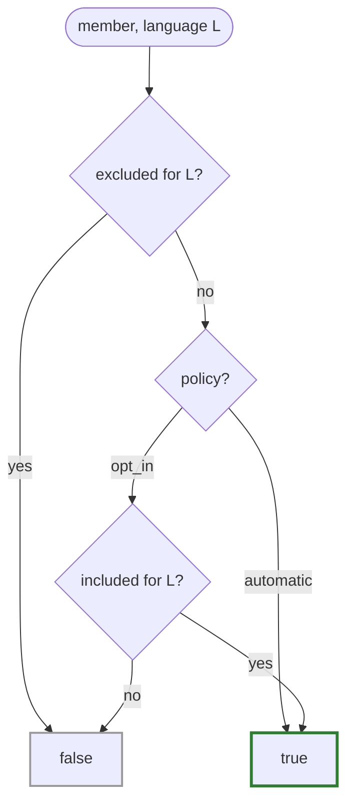

# Annotation vocabulary

Everything welder does is driven by attributes in the `welder::` namespace, spelled
with P3394's `[[=…]]` annotation syntax. There are only a handful.

| Annotation | Meaning |
|---|---|
| `weld(lang…)` | Languages this type is exposed to. **Required to bind.** |
| `policy::automatic` | *(default)* Greedy: reflect every member unless excluded. |
| `policy::opt_in` | Conservative: bind only members marked `include`. |
| `mark::exclude` | Exclude member from **all** welded languages. |
| `mark::exclude(lang…)` | Exclude member from the listed languages only. |
| `mark::include` / `mark::include(lang…)` | Opt a member in (meaningful under `opt_in`). |
| `mark::trust_bindable` / `…(lang…)` | Vouch that a member's type / callable signature is representable outside welder's view. |
| `trust_bindable<T> = true` | Type-level form: trust `T` everywhere it appears. |
| `doc("text")` | Docstring for a class / namespace / function / parameter. |
| `returns("text")` | Documents a function's return value. |
| `tparam("T", "text")` | Documents a template parameter (repeatable, ordered). |
| `weld_as([lang…,] "name")` | Force this entity's target name **verbatim**, bypassing the [name style](naming.md). The name is last; any languages it applies to come first (none = all). |

## `weld` — the discovery marker

`weld` does two things: it declares a type **discoverable** (an independently
registered entity welder may bind, e.g. when walking a namespace), and it lists the
**languages** it is exposed to.

```cpp
struct [[=welder::weld(welder::lang::py, welder::lang::lua)]]  // py + lua
Widget { /* … */ };
```

A `lang` is stored as a bit in an `unsigned` mask, and the value space is **open**:
`welder::lang::py` / `lua` name the shipped languages, while
`welder::user_lang<Slot>` mints an identity for a language welder doesn't ship —
usable everywhere a `lang` is (see
[Binding a new language](extending.md#binding-a-new-language)). `weld` is
*required*: a type with no `weld` binds to nothing.

!!! info "`weld` is not an inheritance directive"

    It marks an entity as independently registrable — the most-derived type's
    `weld` drives which languages bind, and a base *need not* be welded. See
    [Inheritance](inheritance.md).

## `policy` — greedy or conservative

The policy on a type decides the default for its members:

=== "`automatic` (default)"

    ```cpp
    struct [[=welder::weld(welder::lang::py)]]           // policy::automatic implied
    Greedy {
        int a;                              // bound
        int b;                              // bound
        [[=welder::mark::exclude]] int c;   // opted *out*
    };
    ```

=== "`opt_in`"

    ```cpp
    struct
    [[=welder::weld(welder::lang::py), =welder::policy::opt_in]]
    Careful {
        [[=welder::mark::include]] int a;   // bound
        int b;                              // NOT bound (nothing opts it in)
    };
    ```

## `mark` — per-member overrides

`exclude` and `include` are the per-member overrides. Both accept an optional
language list; with no argument they apply to **all** welded languages.

```cpp
struct [[=welder::weld(welder::lang::py, welder::lang::lua)]]
Mixed {
    std::uint32_t first;                                              // bound everywhere
    [[=welder::mark::exclude]] std::uint32_t second;                  // bound nowhere
    [[=welder::mark::exclude(welder::lang::lua)]] std::string third;  // py, not lua
    [[=welder::mark::include(welder::lang::py)]] std::string last;    // opt-in
};
```

## The resolution rule

For a given language `L`, `member_bound(member, L, policy)` decides:



- Excluded for `L` → **false**.
- Else `automatic` → **true**.
- Else (`opt_in`) → **true iff** explicitly included for `L`.

A mask of `0` on an `exclude`/`include` spec is the sentinel for "all languages".

!!! note "Naming deviation"

    The original sketch used `policy::auto`, but `auto` is a reserved keyword, so
    welder spells it `policy::automatic`. Under `automatic`, an `include` mark is
    redundant (a diagnostic for that is a TODO).

The `doc` / `returns` / `tparam` annotations are covered in
[Docstrings](docstrings.md); the two `trust_bindable` forms in
[Trust & type casters](trust-casters.md); and `weld_as` — the verbatim per-entity
rename — in [Naming conventions](naming.md), alongside the pluggable name styles that
reshape identifiers into a target language's convention.
