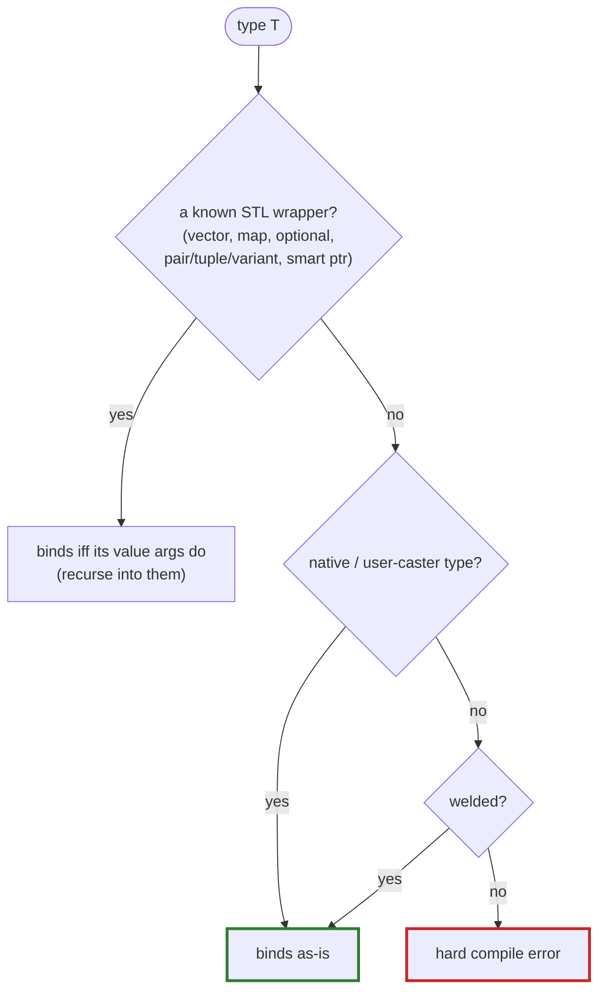

# The bindability gate

Every surface welder is about to bind — a data member, a parameter, a return type,
a namespace variable — must be a type the rod can convert to a **meaningful**
value in the target language. If it can't, welder makes it a **hard compile error**
that names the offending type. Never a silent skip.

!!! danger "Why not just skip it?"

    Binding an unrepresentable type yields a *dead attribute* at runtime **and** a
    stub referencing an unimportable type (which breaks pybind11-stubgen). A
    silent skip would hide both. So welder refuses to compile.

The error (a `static_assert` in `assert_bindable`) names the type and points at the
fix:

> weld the type, give it a rod caster (a pybind11/nanobind `type_caster`, a sol2
> usertype), or `mark::exclude` the member.

## How it decides

The engine is **backend-agnostic** and lives in the core (`bindable.hpp`). It is
driven by a reflection-built table of STL wrappers and how many of their leading
template arguments are *value-bearing*:

```cpp
// {reflection, leading value-arg count}     (0 = all args, e.g. tuple/variant)
{^^std::vector, 1}, {^^std::map, 2}, {^^std::optional, 1}, …
```

Reflection can enumerate a specialization's arguments but *not* tell which are
value-bearing vs. infrastructure (an allocator, comparator, hasher, deleter,
extent). So the per-wrapper leading-arg **count** is the one thing the table still
has to record. `bindable<B, T, L>()` then folds it all:



So `std::vector<Unwelded>` is caught, not just a bare `Unwelded` — the recursion
walks container / `optional` / `pair` / `tuple` / `variant` / smart-pointer value
arguments.

## The one rod-specific leaf

Everything above is shared. The single fact the core cannot know is
**native vs. needs-registration**: can the rod convert `T` *without* welder
registering a class for it? That's the rod's `has_native_caster<T>` (the
`caster_oracle`), the one hook every rod must supply:

| Rod | `has_native_caster<T>` reads |
|---|---|
| **pybind11** | `!_needs_registration<T>` — is T's caster the generic `type_caster_base` fallback? |
| **nanobind** | `!nb::detail::is_base_caster_v<make_caster<T>>` — same question, nanobind's spelling |
| **sol2** (Lua) | `sol::lua_type_of<T> != userdata` — does Lua have a native representation? |

Each is deliberately **conservative** — a compile-time read of T's caster type. It
reports whether T *needs* registration, never whether one will actually exist. So a
hand-registered but non-welded type still reads "needs registration" and is
rejected. (That's what the [trust escape hatches](trust-casters.md) are for.)

!!! info "\"Native\" is relative to your includes"

    `std::complex`, `std::function`, `std::chrono`, `std::filesystem::path` are
    native to pybind11 **only with their converter header** included
    (`<pybind11/complex.h>`, …). Forget the header and the gate correctly reports
    the type as unbindable. The same include-sensitivity applies to nanobind's
    converter headers.

## Not exhaustive for foreign wrappers

The recursion knows the STL containers. A **non-STL wrapper with its own caster**
is treated as an opaque bindable leaf — its elements aren't recursed. That's a
deliberate boundary, not a bug.

## Testing it

Negative-compile cases live in `tests/python/pybind11/cpp/neg/` as `WILL_FAIL` CTests
(`negcompile.*`): they assert that using an unrepresentable type *fails to
compile*. The positive counterparts live alongside the feature tests.

When the gate is too strict — because a type is registered somewhere welder can't
see — reach for [trust & type casters](trust-casters.md).
