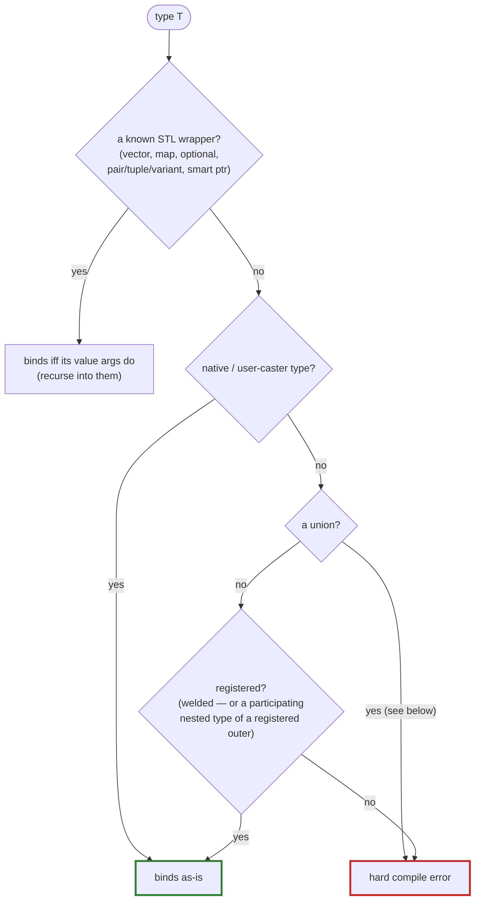

# The bindability gate

Every surface welder is about to bind — a data member, a parameter, a return type,
a namespace variable — must be a type the rod can convert to a **meaningful**
value in the target language. If it can't, welder makes it a **hard compile error**
that names the offending type. Never a silent skip.

!!! danger "Why not just skip it?"

    Binding an unrepresentable type yields a *dead attribute* at runtime **and** a
    stub referencing an unimportable type (which breaks pybind11-stubgen). A
    silent skip would hide both. So welder refuses to compile.

The error (a `static_assert` in `assert_bindable`) names the type and points at the
fix:

> weld the type, give it a rod caster (a pybind11/nanobind `type_caster`, a sol2
> usertype), or `mark::exclude` the member.

## How it decides

The engine is **backend-agnostic** and lives in the core (`bindable.hpp`). It is
driven by a reflection-built table of STL wrappers and how many of their leading
template arguments are *value-bearing*:

```cpp
// {reflection, leading value-arg count}     (0 = all args, e.g. tuple/variant)
{^^std::vector, 1}, {^^std::map, 2}, {^^std::optional, 1}, …
```

Reflection can enumerate a specialization's arguments but *not* tell which are
value-bearing vs. infrastructure (an allocator, comparator, hasher, deleter,
extent). So the per-wrapper leading-arg **count** is the one thing the table still
has to record. `bindable<B, T, L>()` then folds it all:



So `std::vector<Unwelded>` is caught, not just a bare `Unwelded` — the recursion
walks container / `optional` / `pair` / `tuple` / `variant` / smart-pointer value
arguments. The "registered?" leaf mirrors welder's traversal exactly: a welded
type counts, and so does a [nested type](binding-types.md#nested-types) that
participates in its enclosing type's binding — while a nested type that does
*not* participate (excluded, private, forward-declared) fails the gate wherever
a signature names it. The full oracle — including the scope-aware layer that sees
a class's own [member-alias registrations](binding-types.md#member-type-aliases)
— is diagrammed on [The resolution algorithm](../resolution.md#the-bindability-gate-and-its-registration-oracle).

## Unions never bind

A **union** fails the gate unconditionally — welded or not, named or anonymous,
bare or buried in a wrapper (`std::optional<U>`). C++ offers no way to observe
which union member is active, so any accessor welder generated could read an
inactive member — **undefined behavior**. Welder refuses to manufacture that
surface, with designed hard errors at every entry:

- a member, parameter, return type or variable whose type names a union fails
  the gate with a union-specific message;
- `weld_type` on a union, and a `weld` mark on a union in a swept namespace,
  are hard errors of their own;
- an **anonymous union** member is skipped automatically (there is nothing to
  name an attribute by, and no declarator to carry a mark) — the named members
  around it still bind, and the synthesized aggregate constructor is dropped
  (it would leak the unnamed field as a positional parameter). The same rule
  covers unnamed bit-fields.

The fix is almost always **`std::variant`**: it knows its active alternative,
every rod converts it natively as a value (see the wrapper table above), and it
arrives in the target language as the active alternative's natural value. For
an existing C-style API you cannot restructure, expose **accessor functions**
that read the member your C++ code knows is active, `mark::exclude` the
union-typed member, or — if you hand-register the union with the backend
yourself (pybind11 and nanobind both allow it, with this same UB warning in
their docs) — vouch for it via the [trust hatches](trust-casters.md).

!!! warning "Variant alternative order matters across rods"

    Converting *into* a `std::variant` tries the alternatives in declaration
    order on pybind11 / nanobind / LuaBridge3, but in **reverse** declaration
    order on sol2. Keep alternatives unambiguous in the target language (e.g.
    a number vs. a welded class) and the rods agree; two Lua-coercible
    alternatives (`int` + `std::string`) may pick differently per Lua rod.

## The one rod-specific leaf

Everything above is shared. The single fact the core cannot know is
**native vs. needs-registration**: can the rod convert `T` *without* welder
registering a class for it? That's the rod's `has_native_caster<T>` (the
`caster_oracle`), the one hook every rod must supply:

| Rod | `has_native_caster<T>` reads |
|---|---|
| **pybind11** | `!_needs_registration<T>` — is T's caster the generic `type_caster_base` fallback? Enums are *forced* needs-registration (their dedicated caster converts only once the enum is registered) |
| **nanobind** | `!nb::detail::is_base_caster_v<make_caster<T>>` — same question, nanobind's spelling; enums forced likewise |
| **sol2** (Lua) | `sol::lua_type_of<T> != userdata` — does Lua have a native representation? |
| **LuaBridge3** (Lua) | `!luabridge::detail::IsUserdata<T>` — same question, LuaBridge3's spelling |

Each is deliberately **conservative** — a compile-time read of T's caster type. It
reports whether T *needs* registration, never whether one will actually exist. So a
hand-registered but non-welded type still reads "needs registration" and is
rejected. (That's what the [trust escape hatches](trust-casters.md) are for.)

!!! info "“Native” is relative to your includes"

    `std::complex`, `std::function`, `std::chrono`, `std::filesystem::path` are
    native to pybind11 **only with their converter header** included
    (`<pybind11/complex.h>`, …). Forget the header and the gate correctly reports
    the type as unbindable. The same include-sensitivity applies to nanobind's
    converter headers.

## Not exhaustive for foreign wrappers

The recursion knows the STL containers. A **non-STL wrapper with its own caster**
is treated as an opaque bindable leaf — its elements aren't recursed. That's a
deliberate boundary, not a bug.

When the gate is too strict — because a type is registered somewhere welder can't
see — reach for [trust & type casters](trust-casters.md).
