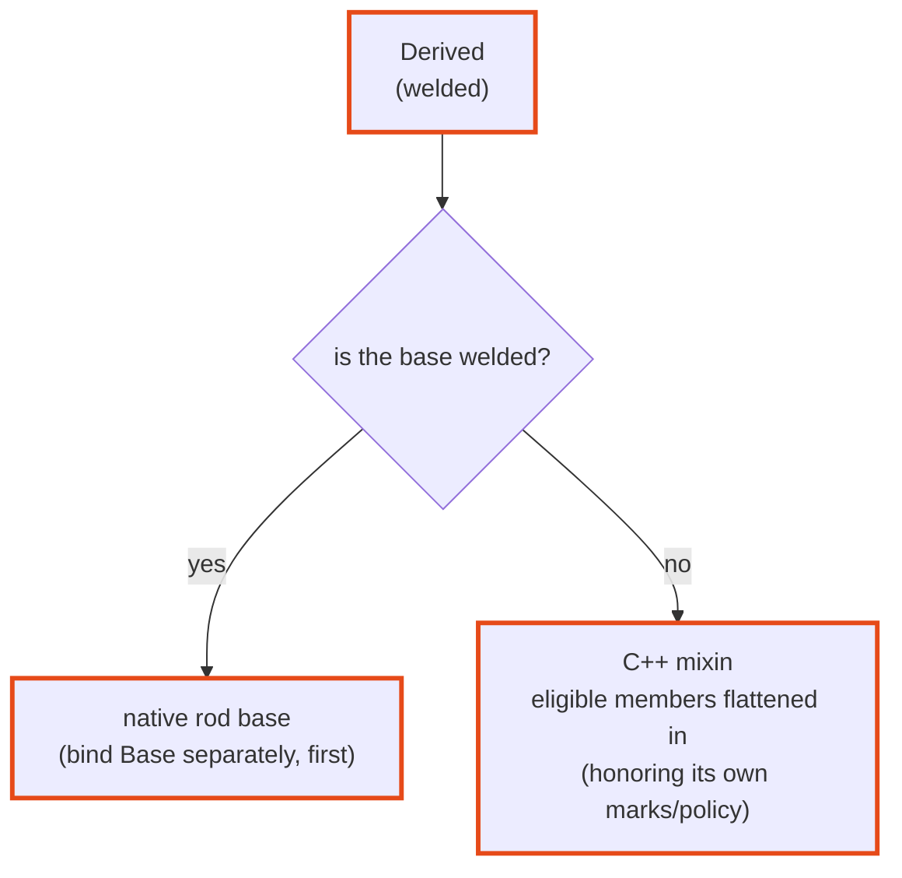

# Inheritance

welder handles a public base one of two ways, depending on whether that base is
itself welded. The distinction follows from `weld` being a **discovery marker** —
an independently-registered entity — rather than an inheritance directive.



!!! example "In the cookbook"

    [Recipe 03 — Inheritance](../cookbook/inheritance.md) runs all three flavors
    (native base, flattened mixin, welded-through-a-bridge);
    [04](../cookbook/virtuals.md) and [05](../cookbook/generated-trampolines.md)
    cover virtual overriding, hand-written and generated.

## Welded base → native base

A **welded** base becomes a native base class in the target framework (pybind11
`class_<T, Base…>`, nanobind `class_<T, Base>`, sol2 `sol::bases<…>`). Bind it
separately, and **first**, so the rod knows the base's class object:

```cpp
struct [[=welder::weld(welder::lang::py, welder::lang::lua)]]
Shape {
    std::string name;
};

struct [[=welder::weld(welder::lang::py, welder::lang::lua)]]
Circle : Shape {          // Shape is welded → a real base class in each language
    double radius{0.0};
};

// bind order: base before derived
using weld = welder::welder<welder::rods::pybind11::rod<>>;  // or ...::sol2::rod / …
weld::weld_type<Shape>(m);
weld::weld_type<Circle>(m);
```

=== ":simple-python: Python"

    ```pycon
    >>> issubclass(Circle, Shape)
    True
    >>> c = Circle(); c.name = "unit"; c.radius = 1.0
    ```

=== ":simple-lua: Lua"

    ```lua
    local c = Circle(); c.name = "unit"; c.radius = 1.0
    print(c.name)          --> unit   (inherited field)
    ```

welder also reaches the **nearest welded ancestors through non-welded ones**
(deduplicated), so an intermediate unwelded layer doesn't hide a welded
grandparent.

## Non-welded base → flattened mixin

A **non-welded** base is treated as a C++ mixin: its eligible members are flattened
into the derived class recursively, honoring *its own* marks and policy.

```cpp
struct Timestamps {                     // NOT welded
    std::uint64_t created{0};
    [[=welder::mark::exclude]] std::uint64_t touched{0};
};

struct [[=welder::weld(welder::lang::py)]]
Record : Timestamps {                   // inherits Timestamps as a mixin
    std::string id;
};
```

`Record` gets `id` and `created` (flattened from `Timestamps`), but not `touched`
(the base's own `exclude` is respected). There is no `Timestamps` Python type.

## Multiple bases and diamonds

How much of the C++ inheritance graph survives depends on the target framework:

| Rod | Multiple welded bases | Virtual diamond |
|---|---|---|
| **pybind11** | ✅ | ✅ |
| **nanobind** | ❌ single base only | ❌ |
| **sol2** (Lua) | ✅ | ✅ |
| **LuaBridge3** (Lua) | ✅ | ❌ |

- A **non-virtual** diamond with a shared *welded* base is a genuine C++ ambiguity
  — welder does not work around it (nor should it; it's ambiguous in C++ too).
- On **nanobind**, `nb::class_<T, Base>` takes a single base, so a multi-base type
  won't bind there. See the
  [Python rods comparison](../backends/python.md#feature-comparison).
- On **LuaBridge3**, base casts are plain pointer arithmetic, which a **virtual**
  base breaks — non-virtual multiple inheritance works, a virtual diamond does
  not. See [how it differs from sol2](../backends/luabridge.md#how-it-differs-from-sol2).

## Overriding virtual methods from Python

If a welded type has `virtual` methods, a Python subclass can only override them
when the class is bound with a **trampoline** — a C++ subclass that captures each
virtual call and forwards it to Python. welder cannot generate that subclass for
you: emitting the override declarations would need member-injection, which C++26
reflection does not provide, and each override must be a real member function
sharing the base method's name (a vtable requirement). So the trampoline is still
hand-written — but welder drives everything *around* it from reflection and refuses
to silently bind a virtual type as non-overridable.

Because of that, a welded type carrying an overridable virtual must do one of two
things.

**1. Register a trampoline.** Write the subclass with welder's neutral macros — one
storage line, one line per virtual — and mark it a trampoline. welder infers the
base from the subclass and discovers it by scanning that base's namespace:

```cpp
#include <welder/rods/python/nanobind/trampoline.hpp>   // before your trampoline

struct [[=welder::weld(welder::lang::py)]] Animal {
    virtual ~Animal() = default;
    virtual std::string speak() const { return "..."; }
    virtual int legs() const { return 4; }
    std::string describe() const {                  // C++ calls the virtuals
        return speak() + " on " + std::to_string(legs()) + " legs";
    }
};

struct [[=welder::rods::python::trampoline]] PyAnimal : Animal {
    WELDER_PY_TRAMPOLINE(Animal);                            // slot count = reflected
    std::string speak() const override { WELDER_PY_OVERRIDE(speak); }
    int         legs()  const override { WELDER_PY_OVERRIDE(legs); }
};
```

Now a Python subclass overrides as expected, and — the whole point — a C++ call
routes *back into* the override:

```python
class Dog(mymod.Animal):
    def speak(self): return "woof"

Dog().describe()   # "woof on 4 legs"  — describe() (C++) called speak() (Python)
```

`WELDER_PY_OVERRIDE(name, args…)` forwards the method's arguments; the return type,
the method name, and whether the method is pure are all read from reflection, so the
macro body never repeats them. The trampoline's slot count is reflected from the
class, so it never drifts. welder checks at **compile time** that the trampoline
overrides *every* overridable virtual — a forgotten override is a build error, not a
method that silently never reaches Python.

!!! note "Derived welded types cover inherited virtuals too"
    If you weld a class that *inherits* virtuals from a welded base — whether or not it
    re-declares them — its own trampoline must override the inherited virtuals as well,
    because a Python subclass can override them and the dispatch runs through the
    derived type's trampoline, not the base's. welder's slot count and coverage check
    walk the whole base chain, so this is enforced at compile time; write one
    `WELDER_PY_OVERRIDE` line per inherited virtual just as you would for the type's
    own. (A virtual overridden along the way counts once, as a single slot.)

!!! note "The explicit form: `trampoline_for<T>`"
    The `[[=trampoline]]` annotation is discovered by scanning the base's namespace,
    so the trampoline must live in the **same namespace** as its welded base (there
    is no global type enumeration in reflection). For a **third-party** base you
    cannot annotate, a trampoline kept in a **different** namespace, or to
    disambiguate two trampolines deriving from the same base, register it explicitly
    with a variable-template specialization instead — it takes precedence over the
    annotation:

    ```cpp
    template <> constexpr std::meta::info
        welder::rods::python::trampoline_for<Animal> = ^^PyAnimal;   // no [[=trampoline]] needed
    ```

    This is the type-level counterpart of [`trust_bindable`](trust-casters.md).

**2. Opt out with `bind_flat`.** A type produced by C++ and never subclassed in
Python does not need a trampoline; mark it (or an individual virtual) as bound flat:

```cpp
struct [[=welder::weld(welder::lang::py)]]
       [[=welder::rods::python::bind_flat]]        // whole type: not overridable
Handle { virtual ~Handle() = default; virtual int fd() const { return -1; } };

struct [[=welder::weld(welder::lang::py)]] Animal {
    virtual ~Animal() = default;
    virtual std::string speak() const { return "..."; }        // overridable
    [[=welder::rods::python::bind_flat]]
    virtual std::string kingdom() const { return "Animalia"; } // this one: flat
};
```

A per-method `bind_flat` keeps that virtual a plain, callable bound method but drops
it from the trampoline's slot count and coverage requirement, while the type's other
virtuals stay overridable.

### Abstract bases (pure virtuals)

A pure virtual works the same way — the trampoline's override supplies it:

```cpp
struct [[=welder::weld(welder::lang::py)]] Shape {
    virtual ~Shape() = default;
    virtual double area() const = 0;                 // pure virtual
    double scaled_area(double f) const { return area() * f; }
};
struct [[=welder::rods::python::trampoline]] PyShape : Shape {
    WELDER_PY_TRAMPOLINE(Shape);
    double area() const override { WELDER_PY_OVERRIDE(area); }
};
```

```python
class Circle(mymod.Shape):
    def __init__(self, r): super().__init__(); self.r = r
    def area(self): return 3.14159 * self.r ** 2

Circle(2).scaled_area(10)   # 125.66 — C++ scaled_area() called the Python area()
```

An abstract type is not default-constructible in C++, so welder registers the
*trampoline's* constructor instead (that is what `construction_type` selects) — so a
Python subclass is constructible. A consequence of the frameworks: the base itself
becomes constructible too, and calling a pure virtual that a subclass did not
override raises at call time (a `RuntimeError`), rather than being blocked at
construction.

!!! note "Backend support"
    Virtual-override support works on **both** Python rods (pybind11 and nanobind).
    The vocabulary (`trampoline_for`, `bind_flat`, the `WELDER_PY_*` macros) lives
    under `welder::rods::python` and is backend-neutral: the *same* trampoline source
    compiles under either rod — only the `#include` of the backend's `trampoline.hpp`
    differs (nanobind keeps a small per-instance storage member; pybind11 needs none).
    A virtual returning a **reference** cannot be trampolined (neither backend can
    keep the referent alive across the boundary) — return by value, a pointer, or use
    `bind_flat`. A pointer return works and crosses back from Python as an instance
    or `None` (annotate the [return policy](return-policies.md) if it is non-owning).

### Overloaded virtuals

An **overloaded** virtual needs one more spelling. `WELDER_PY_OVERRIDE(send)` reads
the method's reflection from its name — but `^^Robot::send` is ill-formed when
`send` names an overload set (C++26 reflection has no overload-set reflection). Use
the general form, `WELDER_PY_OVERRIDE_AS`, and select the overload by its function
type with `welder::rods::python::virtual_slot`:

```cpp
struct [[=welder::weld(welder::lang::py)]] Robot {
    virtual ~Robot() = default;
    virtual std::string send(int code) const;                 // two overloads
    virtual std::string send(const std::string& text) const;
    std::string transmit() const { return send(7) + send("hi"); }
};

struct [[=welder::rods::python::trampoline]] PyRobot : Robot {
    WELDER_PY_TRAMPOLINE(Robot);
    std::string send(int code) const override {
        WELDER_PY_OVERRIDE_AS((welder::rods::python::virtual_slot(
                                  ^^Robot, "send", ^^std::string(int) const)),
                              send, code);
    }
    std::string send(const std::string& text) const override {
        WELDER_PY_OVERRIDE_AS(
            (welder::rods::python::virtual_slot(
                ^^Robot, "send", ^^std::string(const std::string&) const)),
            send, text);
    }
};
```

The extra parentheses around the first argument keep its commas out of the
preprocessor's argument splitting; a name/type pair matching no virtual is a
compile error naming `virtual_slot`'s diagnostic function. *Generated* trampolines
(below) use this form for every override, so there overloads need nothing at all.

On the Python side both C++ overloads dispatch into the **one** Python method of
that name (both backends look the override up by name) — distinguishing the
argument shapes is the override's own business:

```python
class Radio(mymod.Robot):
    def send(self, payload):            # serves send(int) AND send(str)
        return f"py:{payload}"
```

### Covariant returns, protected and private virtuals

A **covariant** override (`Tree* parent()` narrowing `Plant* parent()`) is the same
vtable slot: welder counts it once, and the trampoline redeclares it with the
**most-derived** (narrowed) return type — which is what a generated trampoline
emits automatically.

A **protected** virtual — the classic NVI/template-method hook — is a real
trampoline slot: a Python subclass overrides it as a plain attribute (no binding is
involved in the lookup), and C++ calls dispatch into the override. By default the
method itself is never *bound* (protected members stay uncallable from Python);
give the type
[`policy::weld_protected`](annotations.md#policyweld_protected-expose-the-protected-surface)
and the hook binds too, so a subclass can also *call* it — the full NVI story. A
**private** virtual is not a slot: the trampoline's base-class fallback could not
name it. Privatizing an inherited virtual in a derived class likewise withdraws the
slot from the derived type's trampoline.

### Generating trampolines automatically

Writing the trampoline by hand is mechanical — one `WELDER_PY_OVERRIDE` line per
virtual — so welder can **generate the whole header for you** from the same
reflection, via the build-time `welder::rods::trampolines` rod. You still can't have
welder *synthesize* the subclass as a live type (C++ has no way to inject the override
declarations), but the rod emits it as ordinary source the binding TU compiles:

```cpp
#include <welder/rods/python/trampolines/module.hpp>
WELDER_TRAMPOLINES_MAIN(mymod)   // a generator main() that writes mymod's trampolines
```

`welder_generate_trampolines()` (CMake) builds that generator and runs it into a
`.hpp` of `struct … : T { WELDER_PY_TRAMPOLINE(T); … };` blocks plus their
`trampoline_for<T>` registrations — one per welded virtual type in the namespace,
inherited virtuals covered, `bind_flat` honoured. The binding TU includes the active
backend's `trampoline.hpp`, then the generated header, then binds as usual; the
generated header is **backend-neutral**, so one header serves pybind11 and nanobind.
Each override *splices* the base virtual's own reflected return/parameter types, so the
signature matches by construction no matter how hairy the type — parameterful,
`noexcept`, non-`const`, **overloaded** (each overload dispatches on its own slot
reflection), **covariant** (one override, the narrowed return) and **protected NVI**
virtuals all come out correct with zero hand-written code.

A **class-template instantiation** is covered too, through its
[namespace-scope alias](templates.md#welding-through-an-alias-the-namespace-sweep):
the alias gives the generator the one thing a specialization lacks — a C++
spelling — so `using IntRing = Ring<int>;` in the welded namespace yields a
generated trampoline deriving from (and registering `trampoline_for` under)
`IntRing`. Welding a bare specialization into the generator without an alias is a
compile error pointing you at this route. (A *hand-written* trampoline for an
instantiation needs no alias — `trampoline_for<Ring<int>>` works directly.)

The one shape reflection cannot reproduce is a **C-style variadic** virtual
(`f(int, ...)`): C++26 reflection exposes no ellipsis query. Such a virtual makes the
generator emit a `static_assert` (a clear compile error) unless you mark it
`[[=welder::rods::python::bind_flat]]`.

Next: [Namespaces & modules](namespaces-modules.md).
