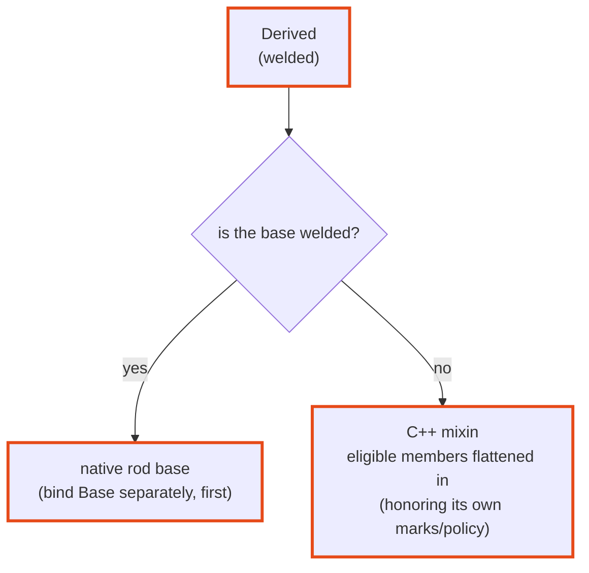

# Inheritance

welder handles a public base one of two ways, depending on whether that base is
itself welded. The distinction follows from `weld` being a **discovery marker** —
an independently-registered entity — rather than an inheritance directive.



## Welded base → native base

A **welded** base becomes a native base class in the target framework (pybind11
`class_<T, Base…>`, nanobind `class_<T, Base>`, sol2 `sol::bases<…>`). Bind it
separately, and **first**, so the rod knows the base's class object:

```cpp
struct [[=welder::weld(welder::lang::py, welder::lang::lua)]]
Shape {
    std::string name;
};

struct [[=welder::weld(welder::lang::py, welder::lang::lua)]]
Circle : Shape {          // Shape is welded → a real base class in each language
    double radius{0.0};
};

// bind order: base before derived
using weld = welder::welder<welder::rods::pybind11::rod>;  // or ...::sol2::rod / …
weld::weld_type<Shape>(m);
weld::weld_type<Circle>(m);
```

=== "Python"

    ```pycon
    >>> issubclass(Circle, Shape)
    True
    >>> c = Circle(); c.name = "unit"; c.radius = 1.0
    ```

=== "Lua"

    ```lua
    local c = Circle(); c.name = "unit"; c.radius = 1.0
    print(c.name)          --> unit   (inherited field)
    ```

welder also reaches the **nearest welded ancestors through non-welded ones**
(deduplicated), so an intermediate unwelded layer doesn't hide a welded
grandparent.

## Non-welded base → flattened mixin

A **non-welded** base is treated as a C++ mixin: its eligible members are flattened
into the derived class recursively, honoring *its own* marks and policy.

```cpp
struct Timestamps {                     // NOT welded
    std::uint64_t created{0};
    [[=welder::mark::exclude]] std::uint64_t touched{0};
};

struct [[=welder::weld(welder::lang::py)]]
Record : Timestamps {                   // inherits Timestamps as a mixin
    std::string id;
};
```

`Record` gets `id` and `created` (flattened from `Timestamps`), but not `touched`
(the base's own `exclude` is respected). There is no `Timestamps` Python type.

## Multiple bases and diamonds

How much of the C++ inheritance graph survives depends on the target framework:

| Rod | Multiple welded bases | Virtual diamond |
|---|---|---|
| **pybind11** | ✅ | ✅ |
| **sol2** (Lua) | ✅ | ✅ |
| **nanobind** | ❌ single base only | ❌ |

- A **virtual** diamond works on the rods that support multiple bases.
- A **non-virtual** diamond with a shared *welded* base is a genuine C++ ambiguity
  — welder does not work around it (nor should it; it's ambiguous in C++ too).
- On **nanobind**, `nb::class_<T, Base>` takes a single base, so a multi-base type
  won't bind there. See the
  [Python rods comparison](../backends/python.md#feature-comparison).

Next: [Namespaces & modules](namespaces-modules.md).
