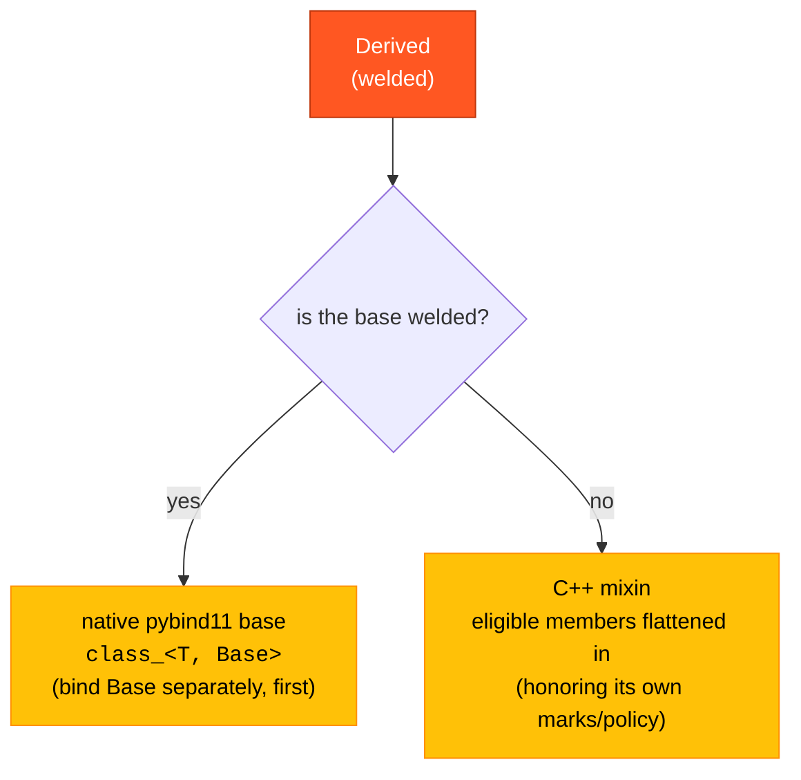

# Inheritance

welder handles a public base one of two ways, depending on whether that base is
itself welded. The distinction follows from `weld` being a **discovery marker** —
an independently-registered entity — rather than an inheritance directive.



## Welded base → native base

A **welded** base becomes a native pybind11 base (`class_<T, Base…>`). Bind it
separately, and **first**, so pybind11 knows the class object:

```cpp
struct [[=welder::weld(welder::lang::py)]]
Shape {
    std::string name;
};

struct [[=welder::weld(welder::lang::py)]]
Circle : Shape {          // Shape is welded → a real Python base class
    double radius{0.0};
};

// bind order: base before derived
welder::pybind11::bind<Shape>(m);
welder::pybind11::bind<Circle>(m);
```

```pycon
>>> issubclass(Circle, Shape)
True
>>> c = Circle(); c.name = "unit"; c.radius = 1.0
```

welder also reaches the **nearest welded ancestors through non-welded ones**
(deduplicated), so an intermediate unwelded layer doesn't hide a welded
grandparent.

## Non-welded base → flattened mixin

A **non-welded** base is treated as a C++ mixin: its eligible members are flattened
into the derived class recursively, honoring *its own* marks and policy.

```cpp
struct Timestamps {                     // NOT welded
    std::uint64_t created{0};
    [[=welder::mark::exclude]] std::uint64_t touched{0};
};

struct [[=welder::weld(welder::lang::py)]]
Record : Timestamps {                   // inherits Timestamps as a mixin
    std::string id;
};
```

`Record` gets `id` and `created` (flattened from `Timestamps`), but not `touched`
(the base's own `exclude` is respected). There is no `Timestamps` Python type.

## Diamonds

- A **virtual** diamond works.
- A **non-virtual** diamond with a shared *welded* base is a genuine C++ ambiguity
  — welder does not work around it (nor should it; it's ambiguous in C++ too).

Next: [Namespaces & modules](namespaces-modules.md).
