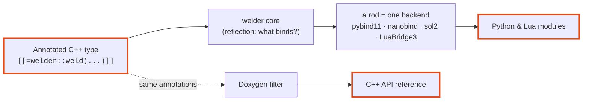

---
hide:
  - navigation
  - toc
---

# welder

<p style="font-size: 1.25rem; opacity: 0.85; margin-top: -0.5rem;">
Generate language bindings for annotated C++ types straight from
<strong>C++26 reflection</strong> — no external code generator, no parsing step.
</p>

You mark a type with attributes describing *which languages* it should be exposed
to and *which members* participate; welder reflects over it at **compile time** and
emits the binding registration code (e.g. pybind11 `class_<T>` calls) directly.

```cpp
#include <welder/vocabulary.hpp>            // annotation vocabulary
#include <pybind11/pybind11.h>
#include <welder/rods/python/pybind11/rod.hpp>     // the pybind11 rod

struct [[=welder::weld(welder::lang::py)]]  // expose to Python
Point {
    double x{0.0};
    double y{0.0};

    [[=welder::mark::exclude]]              // bound nowhere
    std::uint64_t internal_id{0};
};

PYBIND11_MODULE(shapes, m) {
    // reflects Point, emits the binding
    welder::welder<welder::rods::pybind11::rod<>>::weld_type<Point>(m);
}
```

```pycon
>>> import shapes
>>> p = shapes.Point(); p.x = 1.5
>>> p.x
1.5
>>> hasattr(p, "internal_id")
False
```

## Why welder?

### The problem: your data model, typed twice

Hand-written bindings are a second copy of your headers. Exposing a struct to Python
means one `.def_readwrite("velocity", &Body::velocity)` per field — every name
spelled again, by hand, in another file. For a couple of types that's fine; for the
**dozens of plain structs** a file format, a message schema, or a simulation's state
needs, the binding layer becomes a shadow of your data model that silently rots the
moment someone adds a field. The compiler won't warn you — the attribute is just
missing at runtime.

welder deletes that copy. Reflection already knows the fields; welder reads them and
emits the registration calls for you. Add a field, rebuild, and it is bound. The
annotations declare only *intent* — which languages, which members — never the shape
of the type.

### What welder is *not*

welder removes boilerplate; it is **not** a universal binding abstraction. On
purpose, it does not try to:

- **Convert your types for you.** Carrying a custom or non-trivial type across the
  language boundary is still the framework's job — a pybind11 `type_caster`, a
  nanobind caster, a sol2 usertype. welder binds what the framework can already move
  (and [refuses to compile](guide/bindability.md), loudly, when it can't); it
  invents no conversions of its own.
- **Replace the binding framework.** You keep using pybind11 / nanobind / sol2, and
  keep reaching for their APIs for anything bespoke — a hand-tuned overload, a custom
  `__repr__`, an ownership or GIL policy. welder generates the *repetitive*
  registration and then gets out of the way; your framework-specific code sits right
  beside it (that's what the module hooks and the returned class handle are for).
- **Flatten the languages into one lowest-common-denominator API.** Each language
  still gets its idiomatic surface — Python dunders, Lua metamethods — because welder
  maps onto each framework rather than hiding it.

<div class="grid cards" markdown>

-   :material-rocket-launch:{ .lg .middle } **No codegen step**

    ---

    The bindings *are* the compile. welder reads P2996 reflection + P3394
    annotations in-process — no `.i` files, no generator to run, no parser to
    keep in sync with your headers.

    [:octicons-arrow-right-24: Getting started](guide/getting-started.md)

-   :material-tag-multiple:{ .lg .middle } **A tiny vocabulary**

    ---

    `weld`, `policy`, `mark`, `doc`, `returns`, `tparam`. Say what binds and to
    which languages; welder resolves the rest at compile time.

    [:octicons-arrow-right-24: Annotation vocabulary](guide/annotations.md)

-   :material-shield-check:{ .lg .middle } **Fail-safe by contract**

    ---

    Every surface welder is about to bind must be representable — otherwise a
    **hard compile error** naming the offending type, never a silent skip.

    [:octicons-arrow-right-24: The bindability gate](guide/bindability.md)

-   :material-book-open-variant:{ .lg .middle } **One annotation, two audiences**

    ---

    A `doc` becomes the Python `__doc__` *and* — via a Doxygen filter — the C++
    reference. Write it once.

    [:octicons-arrow-right-24: Docstrings](guide/docstrings.md)

</div>

---

## How it fits together



A language-agnostic **core** owns all the reflection work — deciding *what* binds,
whether each type is *representable*, and walking types/namespaces/bases. A
**rod** (a welding rod: `welder::rods::<name>::rod`) is a stateless policy struct
supplying only the emission primitives (how to register a class/method/property in
its framework), driven through the one entry point `welder::welder<Rod>`. Adding a
language is one rod struct; the core is reused verbatim. The *same* annotated type
binds to **Python** (pybind11 or nanobind) and **Lua** (sol2 or LuaBridge3) — you
weld it once.

[:octicons-arrow-right-24: Read the architecture](architecture.md){ .md-button }
[:octicons-arrow-right-24: Explore the languages](backends/index.md){ .md-button }
[:octicons-arrow-right-24: Browse the C++ reference](reference.md){ .md-button .md-button--primary }

!!! warning "Early proof-of-concept"

    welder targets **C++26 and newer only**, and today **gcc-16 is the only
    compiler** that implements P2996 + P3394. Three rods — **pybind11** and
    **nanobind** (Python) and **sol2** (Lua) — are verified end-to-end against the
    *same* shared C++ cases; properties and further languages are designed-for but
    not yet implemented.
