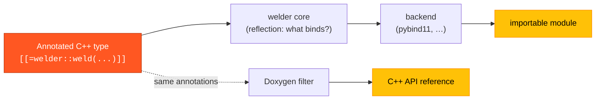

---
hide:
  - navigation
  - toc
---

# welder

<p style="font-size: 1.25rem; opacity: 0.85; margin-top: -0.5rem;">
Generate language bindings for annotated C++ types straight from
<strong>C++26 reflection</strong> — no external code generator, no parsing step.
</p>

You mark a type with attributes describing *which languages* it should be exposed
to and *which members* participate; welder reflects over it at **compile time** and
emits the backend registration code (e.g. pybind11 `class_<T>` calls) directly.

```cpp
import welder;                              // annotation vocabulary
#include <pybind11/pybind11.h>
#include <welder/backends/pybind11.hpp>     // the pybind11 backend

struct [[=welder::weld(welder::lang::py)]]  // expose to Python
Point {
    double x{0.0};
    double y{0.0};

    [[=welder::mark::exclude]]              // bound nowhere
    std::uint64_t internal_id{0};
};

PYBIND11_MODULE(shapes, m) {
    welder::pybind11::bind<Point>(m);       // reflects Point, emits the binding
}
```

```pycon
>>> import shapes
>>> p = shapes.Point(); p.x = 1.5
>>> p.x
1.5
>>> hasattr(p, "internal_id")
False
```

<div class="grid cards" markdown>

-   :material-rocket-launch:{ .lg .middle } **No codegen step**

    ---

    The bindings *are* the compile. welder reads P2996 reflection + P3394
    annotations in-process — no `.i` files, no generator to run, no parser to
    keep in sync with your headers.

    [:octicons-arrow-right-24: Getting started](guide/getting-started.md)

-   :material-tag-multiple:{ .lg .middle } **A tiny vocabulary**

    ---

    `weld`, `policy`, `mark`, `doc`, `returns`, `tparam`. Say what binds and to
    which languages; welder resolves the rest at compile time.

    [:octicons-arrow-right-24: Annotation vocabulary](guide/annotations.md)

-   :material-shield-check:{ .lg .middle } **Fail-safe by contract**

    ---

    Every surface welder is about to bind must be representable — otherwise a
    **hard compile error** naming the offending type, never a silent skip.

    [:octicons-arrow-right-24: The bindability gate](guide/bindability.md)

-   :material-book-open-variant:{ .lg .middle } **One annotation, two audiences**

    ---

    A `doc` becomes the Python `__doc__` *and* — via a Doxygen filter — the C++
    reference. Write it once.

    [:octicons-arrow-right-24: Docstrings](guide/docstrings.md)

</div>

---

## How it fits together



A language-agnostic **core** owns all the reflection work — deciding *what* binds,
whether each type is *representable*, and walking types/namespaces/bases. A
**backend** is a stateless policy struct supplying only the emission primitives
(how to register a class/method/property in its framework). Adding a language is
one backend struct; the core is reused verbatim.

[:octicons-arrow-right-24: Read the architecture](architecture.md){ .md-button }
[:octicons-arrow-right-24: Browse the C++ reference](reference.md){ .md-button .md-button--primary }

!!! warning "Early proof-of-concept"

    welder targets **C++26 and newer only**, and today **gcc-16 is the only
    compiler** that implements P2996 + P3394. The pybind11 backend is verified
    end-to-end; properties and additional languages (Lua, …) are designed-for but
    not yet implemented.
