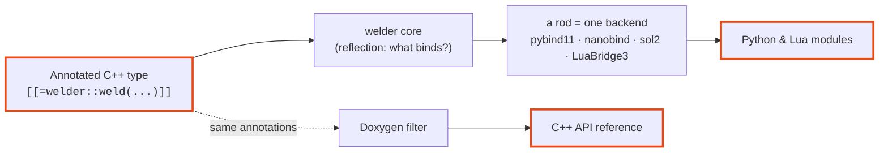

---
hide:
  - navigation
  - toc
---

# welder

<p style="font-size: 1.25rem; opacity: 0.85; margin-top: -0.5rem;">
Generate language bindings for annotated C++ types straight from
<strong>C++26 reflection</strong> — no external code generator, no parsing step.
</p>

You mark a C++ entity with attributes describing *which languages* (currently Python & Lua) it should be
exposed to and *which members* participate; welder reflects over it at **compile time** and emits the binding
registration boilerplate directly, through template instantiation. On top of that, it carries the reflected
documentation into the target-language module, enabling IDE autocompletion and static analysis.

```cpp
#include <welder/vocabulary.hpp>            // annotation vocabulary
#include <pybind11/pybind11.h>
#include <welder/rods/python/pybind11/rod.hpp>     // the pybind11 rod

struct [[=welder::weld(welder::lang::py)]]  // expose to Python
Point {
    double x{0.0};
    double y{0.0};

    [[=welder::mark::exclude]]              // bound nowhere
    std::uint64_t internal_id{0};
};

PYBIND11_MODULE(shapes, m) {
    // reflects Point, emits the binding
    welder::welder<welder::rods::pybind11::rod<>>::weld_type<Point>(m);
}
```

```pycon
>>> import shapes
>>> p = shapes.Point(); p.x = 1.5
>>> p.x
1.5
>>> hasattr(p, "internal_id")
False
```

## Why welder?

### The problem: your data model, typed more than once

Hand-written bindings are a second copy of your headers. When you bind a project to
multiple languages, the number of these copies explodes. Consider binding a simple
struct to Python & Lua:

<div class="grid cards" markdown>

- ### C++ (vec2.hpp)

    ```cpp
    #include <cmath>
  
    struct Vec2
    {
        float x = 0.0f;
        float y = 0.0f;

        Vec2() = default;
        Vec2(float x, float y)
            : x(x), y(y) {}

        float length() const {
            return std::sqrt(x * x + y * y);
        }

        Vec2 operator+(const Vec2& other) const {
            return {x + other.x, y + other.y};
        }
    };
    ```

- ### pybind11

    ```cpp
    #include "vec2.hpp"
    #include <pybind11/pybind11.h>
  
    namespace py = pybind11;

    PYBIND11_MODULE(example, m)
    {
        py::class_<Vec2>(m, "Vec2")
            .def(py::init<>())
            .def(py::init<float, float>())
            .def_readwrite("x", &Vec2::x)
            .def_readwrite("y", &Vec2::y)
            .def("length", &Vec2::length)
            .def("__add__", &Vec2::operator+);
    }
    ```

- ### LuaBridge3
    
    ```cpp
    #include "vec2.hpp"
    #include <LuaBridge/LuaBridge.h>
  
    using namespace luabridge;

    getGlobalNamespace(L)
        .beginClass<Vec2>("Vec2")
            .addConstructor<void(), void(float, float)>()
            .addProperty("x", &Vec2::x)
            .addProperty("y", &Vec2::y)
            .addFunction("length", &Vec2::length)
            .addFunction("__add", &Vec2::operator+)
        .endClass();
    ```

</div>


Exposing a struct to Python means one `.def_readwrite("x", &Vec2::x)` per field
(same idea for methods) — every name spelled again, by hand, in another file and in stringified form.
For a couple of types that is fine; but for the **dozens of types** a binary protocol needs,
the binding layer becomes a shadow of your code that silently rots the moment someone adds a field or
renames a method. The compiler won't warn you — the attribute is simply missing at runtime, and the
rename never reaches the target language.

welder deletes that copy. Reflection has a clear view of the C++ entities; welder reads them and
emits the registration calls under the hood, driven by unobtrusive in-code annotations.
Add a field, function, or type, rebuild, and it is bound — and reflected in the target-language
docs and typing stubs. The annotations declare only *intent*: which languages to bind to, which
members to expose, and, most importantly, the style of their exposure.

Some languages, such as Python, have well-established, widely adopted code styles (PEP 8).
The C++ library you are binding may follow a different convention. welder automatically coerces the
original entity names through an injectable, predefined code-style transformer. Similar transformers
exist for docstrings.

Docstring formats vary between languages and depend heavily on the documentation-generation tooling in
use. welder provides injectable docstring transformers to match your tooling, plus a Doxygen filter that
sources the docstrings of welded C++ entities from welder's annotations. Generating documented bindings
does not undermine your C++ documentation, nor does it require you to repeat yourself — the same
annotated definition feeds the Python stub and the Lua stub (and, via the Doxygen filter, the C++
reference), each through its own entry point and style transformers:

=== ":simple-cplusplus: C++ (geom.hpp + entry points)"

    ```cpp
    // geom.hpp — the one annotated definition (idiomatic C++ house style)
    #include <welder/vocabulary.hpp>

    namespace geom {

    struct [[=welder::weld(welder::lang::py, welder::lang::lua)]]
           [[=welder::doc("A 2-D vector.")]]
    Vec2
    {
        [[=welder::doc("The x component.")]] float X = 0.0f;
        [[=welder::doc("The y component.")]] float Y = 0.0f;

        Vec2() = default;
        Vec2(float x, float y)
            : X(x), Y(y) {}

        [[=welder::doc("Squared Euclidean length.")]]
        [[=welder::returns("the squared magnitude")]]
        float LengthSquared() const {
            return X * X + Y * Y;
        }
    };

    } // namespace geom
    ```

    ```cpp
    // geom_py.cpp — the importable Python module (geom.pyi is stubgen'd from it)
    #include <welder/rods/python/pybind11/rod.hpp>
    #include <welder/rods/python/naming.hpp>   // welder::rods::python::pep8

    PYBIND11_MODULE(geom, m) {
        welder::welder<
            welder::rods::pybind11::rod<welder::rods::python::google_style>, // docstring style
            welder::rods::python::pep8>                                      // code style
        ::weld_namespace<^^geom>(m);
    }
    ```

    ```cpp
    // geom_lua.cpp — the require-able Lua module (luaopen_geom)
    #include <sol/sol.hpp>
    #include <welder/rods/lua/sol2/module.hpp>

    WELDER_MODULE(geom, sol2) {}   // binds namespace ^^geom into the module
    ```

    ```cpp
    // geom_stub.cpp — emits geom.lua (LuaCATS ---@meta) at build time
    #include <iostream>
    #include <welder/rods/lua/luacats/rod.hpp>

    int main() {
        welder::rods::luacats::rod
            ::generate<^^geom, welder::naming::none>(std::cout);            // code style
    }
    ```

=== ":simple-python: Python (geom.pyi)"

    ```python
    # X -> x, Y -> y, LengthSquared -> length_squared  (via pep8)
    class Vec2:
        """
        A 2-D vector.
        """
        @typing.overload
        def __init__(self) -> None: ...
        @typing.overload
        def __init__(self, x: float, y: float) -> None: ...
        @property
        def x(self) -> float:
            """
            The x component.
            """
        @x.setter
        def x(self, arg0: float) -> None: ...
        @property
        def y(self) -> float:
            """
            The y component.
            """
        @y.setter
        def y(self, arg0: float) -> None: ...
        def length_squared(self) -> float:
            """
            Squared Euclidean length.

            Returns:
                the squared magnitude
            """
    ```

=== ":simple-lua: Lua (geom.lua)"

    ```lua
    ---@meta
    -- naming::none keeps the raw C++ names (X, Y, LengthSquared)

    geom = {}

    --- A 2-D vector.
    ---@class geom.Vec2
    ---@field X number The x component.
    ---@field Y number The y component.
    geom.Vec2 = {}

    ---@return geom.Vec2
    ---@overload fun(x: number, y: number): geom.Vec2
    function geom.Vec2.new() end

    --- Squared Euclidean length.
    ---@return number the squared magnitude
    function geom.Vec2:LengthSquared() end
    ```


### What welder is *not*

welder removes boilerplate; it is **not** a universal binding abstraction. On
purpose, it does not try to:

- **Convert your types for you.** Carrying a custom or non-trivial type across the
  language boundary is still the framework's job — a pybind11 `type_caster`, a
  nanobind caster, a sol2 usertype, etc. welder binds what the framework can already move
  (and [refuses to compile](guide/bindability.md), loudly, when it can't); it
  invents no conversions of its own.
- **Replace the binding framework.** You keep using pybind11 / nanobind / sol2 / luabridge3, and
  keep reaching for their APIs for anything bespoke — a hand-tuned overload, a custom
  `__repr__`, an ownership or GIL policy. welder generates the *repetitive*
  registration and then gets out of the way; your framework-specific code sits right
  beside it (that's what the module hooks and the returned class handle are for).
- **Flatten the languages into one lowest-common-denominator API.** Each language
  still gets its idiomatic surface — Python dunders, Lua metamethods — because welder
  maps onto each framework rather than hiding it.

<div class="grid cards" markdown>

-   :material-rocket-launch:{ .lg .middle } **No codegen step**

    ---

    The bindings *are* the compile. welder reads P2996 reflection + P3394
    annotations in-process — no `.i` files, no generator to run, no parser to
    keep in sync with your headers.

    [:octicons-arrow-right-24: Getting started](guide/getting-started.md)

-   :material-tag-multiple:{ .lg .middle } **A tiny vocabulary**

    ---

    `weld`, `policy`, `mark`, `doc`, `returns`, `tparam`, `weld_as`. Say what
    binds and to which languages; welder resolves the rest at compile time.

    [:octicons-arrow-right-24: Annotation vocabulary](guide/annotations.md)

-   :material-shield-check:{ .lg .middle } **Fail-safe by contract**

    ---

    Every surface welder is about to bind must be representable — otherwise a
    **hard compile error** naming the offending type, never a silent skip.

    [:octicons-arrow-right-24: The bindability gate](guide/bindability.md)

-   :material-book-open-variant:{ .lg .middle } **One annotation, several audiences**

    ---

    A `doc` becomes the Python `__doc__`, the Lua LuaCATS stub, *and* — via a
    Doxygen filter — the C++ reference. Write it once.

    [:octicons-arrow-right-24: Docstrings](guide/docstrings.md)

</div>

---

## How it fits together



A language-agnostic **core** owns all the reflection work — deciding *what* binds,
whether each type is *representable*, and walking types/namespaces/bases. A
**rod** (a welding rod: `welder::rods::<name>::rod`) is a stateless policy struct
supplying only the emission primitives (how to register a class/method/property in
its framework), driven through the one entry point `welder::welder<Rod>`. Adding a
language is one rod struct; the core is reused verbatim. The *same* annotated type
binds to **Python** (pybind11 or nanobind) and **Lua** (sol2 or LuaBridge3) — you
weld it once.

[:octicons-arrow-right-24: Read the architecture](architecture.md){ .md-button }
[:octicons-arrow-right-24: Cook from the recipes](cookbook/index.md){ .md-button }
[:octicons-arrow-right-24: Explore the languages](backends/index.md){ .md-button }
[:octicons-arrow-right-24: Browse the C++ reference](reference.md){ .md-button .md-button--primary }

!!! warning "Early proof-of-concept"

    welder targets **C++26 and newer only**, and today **gcc-16 is the only
    compiler** that implements P2996 + P3394. Four runtime rods — **pybind11** and
    **nanobind** (Python), **sol2** and **LuaBridge3** (Lua) — are verified
    end-to-end against the *same* shared C++ cases, plus two build-time rods
    (the **LuaCATS** stub and the Python **trampoline** generators). Further
    languages are designed-for but not yet implemented.
