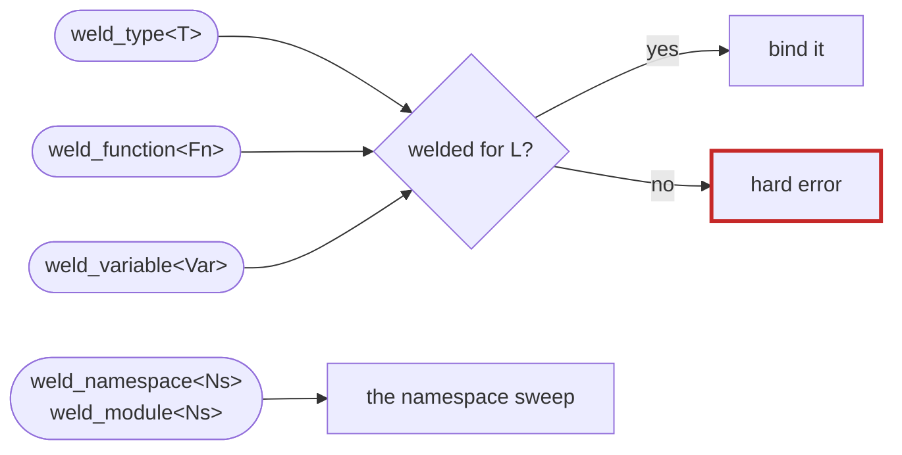
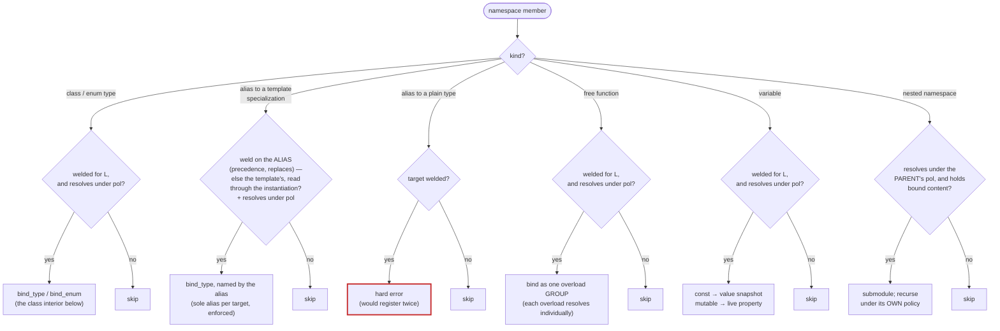
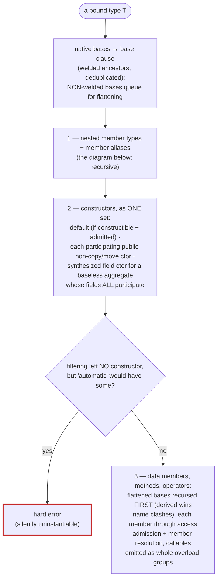
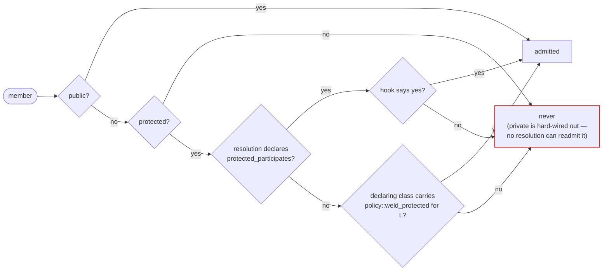
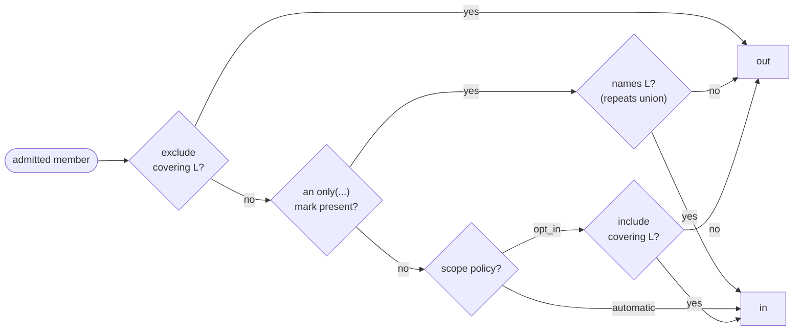
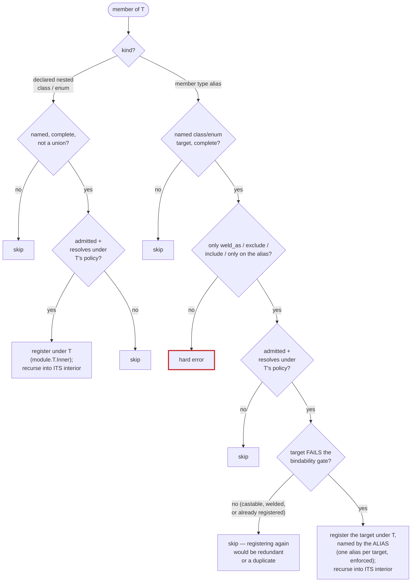
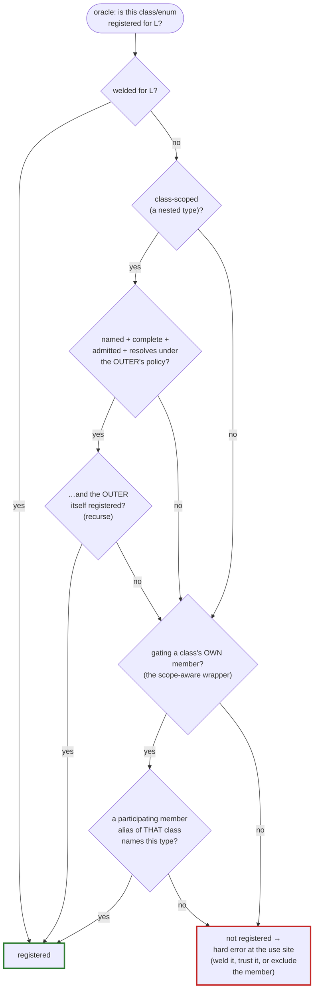

# The resolution algorithm

This page is the single map of **how welder decides what ends up in a binding**
— every entity kind, every rule, in the order the carriage applies them. The
[guide](guide/index.md) explains each feature narratively; this is the
reference picture for when you need to know *exactly* why something did or
didn't bind.

Three separable questions are asked about everything welder touches, each owned
by a different layer:

| # | Question | Layer | Where |
|---|---|---|---|
| 1 | Does this entity **participate**? | the *resolution* (stitch / tack / bespoke) | `marker_resolution` / `greedy_resolution` |
| 2 | May this member's **access level** be exposed? | access admission | `member_access_admitted` |
| 3 | Can its types **cross the language boundary**? | the [bindability gate](guide/bindability.md) + its registration oracle | `bindable()` / `counts_as_registered` |

A "no" from 1 or 2 means the entity is silently left out (that is what marks
are for). A "no" from 3 is a **hard compile error** — welder never emits a
binding that would be dead at runtime.

Everything below describes the default **stitch** (marker-directed) resolution;
the [tack-welding differences](#tack-welding-the-greedy-differences) are
collected at the end.

## Entry points

The manual entry points check only the `weld` marker — calling them *is* the
statement of intent, so the entity's own resolution marks are not re-consulted
(a `weld_function<Fn>` still gathers Fn's *participating* same-name overloads).
The namespace entry points hand everything to the sweep.

## The namespace sweep

`weld_namespace` visits the namespace's members **in declaration order** and
dispatches on kind. `pol` is the namespace's `policy` (default `automatic`);
"resolves" means [member resolution](#member-resolution-and-access-admission)
below.

Two asymmetries worth memorizing:

- **Leaf entities need a `weld`; namespaces never do.** A namespace is a scope,
  not a bindable thing — it becomes a submodule when something inside it binds.
- **Only `weld` / `weld_as` may sit on a namespace-scope alias** — every other
  mark belongs on the class template, where it applies to all instantiations
  (diagnosed, not ignored).

## The class interior

Once a type is being bound (from the sweep, from `weld_type`, or as a nested
type), its interior is walked in a fixed order — **nested types first**, so a
member whose default argument or signature names one finds it registered:

Constructor fine print: an *implicit* default constructor has no declaration to
mark, so it is exempt from `opt_in`'s default-out; explicit marks on a declared
one are honored. `mark::exclude`-ing every constructor is the deliberate
factory-only escape (the fail-safe doesn't fire, because `automatic` would also
find none admitted).

## Member resolution and access admission

Every *member* decision — field, method, operator, constructor, enumerator,
nested type, member alias — composes the same two small machines. Access
admission runs first:

then the mark/policy resolution (`member_bound`), **per overload** — a mark on
one constructor or one overload prunes exactly that one:

`only` is the closed-world mark (the *complete* language set, and the opt-in
under `opt_in`); `exclude` beats it; a bare `only()` is diagnosed.

## Nested types and member type aliases

Both are class members, so access admission + member resolution above apply —
the *outer's* policy, the member's own marks, **never a `weld` of their own**.
What differs is the final arbiter:

Consequences that fall straight out of the gate-as-arbiter rule:

- ordinary `using value_type = std::vector<T>;` conventions cost nothing (the
  wrapper is castable → skipped);
- an alias to a welded or sibling-nested type never double-registers;
- `mark::exclude` on a declared nested type + an alias to it = the class-scope
  **rename escape** (the exclude makes the target fail the gate, the alias
  re-registers it under its own name);
- under tack welding *every* complete type passes the greedy gate, so member
  aliases never fire there.

A nested type registers exactly once, with its **declaring** class — a
flattened (non-welded) base's nested types are *not* re-registered on each
derived type; a flattened signature naming one fails the gate until the base is
welded.

## The bindability gate and its registration oracle

Every surface of everything that binds — each member's type, each parameter,
each return — runs the [bindability gate](guide/bindability.md): STL wrappers
recurse into their value arguments, `trust_bindable` and native casters pass,
a **union hard-errors with its own diagnostic** (no sweep can ever register
one — reading an inactive member is UB; use `std::variant`, see
[Unions never bind](guide/bindability.md#unions-never-bind)), and what remains
is a registration-needing class/enum, answered by the **registration oracle**:

The oracle is a **pure predicate of declarations** — never a visited-set — so
multi-pass welds and forward references stay order-independent. Two structural
blind spots follow from "an alias is unrecoverable from the type it names",
and both resolve to [`trust_bindable`](guide/trust-casters.md):

- a type welded only through a **namespace-scope alias** (the third-party
  template opt-in) is invisible to the oracle in signatures;
- a **member-alias** registration is visible only to the registering class's
  own members (the scope-aware wrapper) — not across classes, not at namespace
  level.

## The kinds at a glance

| Entity | Discovery | Resolves under | Named by | Duplicates diagnosed |
|---|---|---|---|---|
| namespace-scope class/enum | its `weld` | the namespace's policy + own marks | identifier → style → `weld_as` | — |
| alias-welded specialization | alias `weld` (precedence) or the template's | the namespace's policy + the instantiation's marks | the alias (its `weld_as` → the template's → styled identifier) | two aliases of one specialization |
| free function / variable | its `weld` | the namespace's policy + own marks | identifier → style → `weld_as` | — |
| nested namespace | never welded | the *parent's* policy; recursed under its own | identifier → style → `weld_as` | — |
| field / method / operator / enumerator | rides the outer's `weld` | the outer's policy + own marks, per overload | identifier → style → `weld_as` | — |
| constructor | rides the outer's `weld` | symmetric, + default-ctor exemption + no-ctor fail-safe | — | — |
| **nested class/enum** | rides the outer's `weld` | the outer's policy + own marks + access admission | identifier → style → `weld_as` | — |
| **member type alias** | rides the outer's `weld` | the outer's policy + alias marks, **iff the target fails the gate** | the alias (its `weld_as` → the target's → styled identifier) | two aliases of one target, per class |

Everywhere a name is produced, a **call-site override** (`weld_type<T>(m,
"Name")`) beats even `weld_as`.

## Tack welding: the greedy differences

[`greedy_resolution`](guide/extending.md#custom-traversal-resolutions-and-carriages)
keeps the whole shape above and changes exactly these knobs:

- **`weld` markers are ignored** — every reflectable type / function / variable
  participates, and namespaces recurse when they hold anything *bindable*
  (marks that happen to be present still prune, via the same member resolution).
- **Every public base is flattened** (`is_native_base` = false) — no reliance
  on a base being separately registered.
- **The registration oracle accepts any complete, non-excluded class/enum** —
  the tacked library's own types pass in its signatures without trust hatches;
  the nested-type chain applies unchanged. The trust is real: a registrable
  type you never actually tack surfaces as the framework's unregistered-type
  error at call time, and a forward-declared type still hard-errors.
- **Member aliases never participate** — everything complete passes the greedy
  gate, so there is nothing left for an alias to register.
- **Protected members** get a whole-pass knob (`greedy_resolution<true>`) since
  a third-party header cannot carry `policy::weld_protected`.

A bespoke resolution may retune any of this — with one obligation: whatever it
*prunes* it must also deny in `counts_as_registered` (nested types included),
or the gate will vouch for registrations the sweep never makes. See
[Extending welder](guide/extending.md).